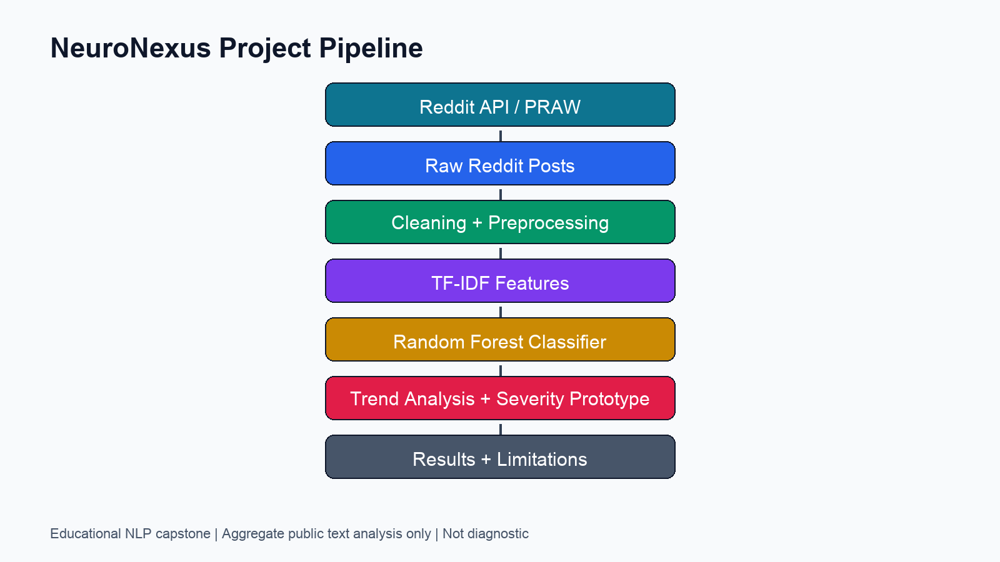

# NeuroNexus: Predicting Mental Health Discussion Trends from Reddit

NeuroNexus is a data science capstone project that analyzes public Reddit discussions related to anxiety, depression, and ADHD. The project uses NLP preprocessing, TF-IDF features, and Random Forest models to study discussion patterns and prototype non-clinical severity scoring.



## Overview

This repository presents a polished version of the NeuroNexus capstone workflow. It focuses on aggregate mental-health discussion trends in public Reddit text, including data acquisition, preprocessing, exploratory analysis, classification experiments, and an experimental severity-scoring prototype.

## Ethical Disclaimer

This project is not designed to diagnose individuals or replace professional mental-health assessment. It analyzes aggregate patterns in public Reddit text for educational and research purposes. The severity score is experimental and should not be interpreted as a clinical measure.

## Problem Statement

Mental-health communities on Reddit contain large volumes of public discussion about symptoms, medication, support, and lived experience. This project asks whether NLP methods can identify broad discussion categories and trend signals across these communities while acknowledging the limits of noisy, self-reported, public social media data.

## Dataset

- Source: public Reddit posts from anxiety, depression, and ADHD-related communities.
- Collection approach: API/PRAW-based workflows and alternative collection approaches due to API access changes.
- Public metric used in this repository: 22,273 merged tokenized rows documented in the project pipeline notebook.
- Modeling notebook sample: 11,803 rows used in the visible classification and severity-scoring workflow.

Raw data files are intentionally not included in this public repository.

## Tech Stack

- Python
- pandas, NumPy
- scikit-learn
- NLTK, spaCy
- matplotlib, seaborn, wordcloud
- PRAW
- Jupyter Notebook

## Project Architecture

```text
Reddit API / PRAW
        |
Raw Reddit Posts
        |
Cleaning + Preprocessing
        |
TF-IDF Features
        |
Random Forest Classifier
        |
Trend Analysis + Severity Prototype
        |
Results + Limitations
```

## Methodology

1. Collected public Reddit posts from mental-health-related communities.
2. Cleaned and normalized text by removing missing content, punctuation, stopwords, and other noisy tokens.
3. Prepared NLP features using tokenization, lemmatization, and TF-IDF vectorization.
4. Explored subreddit-level trends, medication mentions, word frequencies, and n-grams.
5. Trained Random Forest classification experiments using TF-IDF features.
6. Built an experimental severity-scoring layer from keyword signals, intensifiers, qualifiers, and medication mentions.

## Results

| Component | Method | Result | Notes |
|---|---|---:|---|
| Dataset | Reddit public posts | 22,273 merged tokenized rows | From the project pipeline notebook |
| Disorder discussion classification | Random Forest + TF-IDF | 0.72 weighted F1 | Final modeling workflow also recorded 73.99% accuracy |
| Severity scoring | Random Forest regressor + keyword-derived signals | 93.18% pseudo-accuracy within +/-1 | Experimental; not clinically validated |

The repository intentionally avoids claiming a 28K+ dataset or 82% F1-score because those numbers are not proven by the current public notebook evidence.

## Severity Scoring Prototype

Built an experimental severity-scoring layer using keyword signals, intensifiers, qualifiers, and medication mentions. This component is a prototype and would require stronger labeled data and clinical validation before real-world use.

## My Contribution

As part of the NeuroNexus capstone team, I contributed to:

- Reddit data acquisition using API/PRAW-based workflows and alternative collection approaches due to API access changes
- NLP preprocessing, including text cleaning, tokenization, stopword removal, and TF-IDF feature preparation
- Exploratory analysis of subreddit-level mental-health discussion patterns
- Random Forest + TF-IDF classification experiments
- Experimental severity-scoring logic and model evaluation
- Final documentation and project storytelling

## Team Members

Group 11 - NeuroNexus

- Aman Ostwal
- Darshit Rai
- Sai Pokuri
- Sanjoli Sogani

## Repository Structure

```text
Predicting-Mental-Health-Trends/
├── README.md
├── requirements.txt
├── .gitignore
├── LICENSE
├── notebooks/
│   ├── 01_data_collection.ipynb
│   ├── 02_eda_preprocessing.ipynb
│   ├── 03_modeling_classification.ipynb
│   └── 04_severity_scoring_prototype.ipynb
├── src/
│   ├── preprocess.py
│   ├── features.py
│   ├── train_model.py
│   └── severity_scoring.py
├── reports/
│   ├── final_report.pdf
│   └── presentation.pdf
├── visuals/
│   └── pipeline_diagram.png
├── docs/
│   ├── ethics_and_limitations.md
│   └── model_results_summary.md
└── archive/
```

## How to Run

Create and activate a virtual environment:

```bash
python -m venv .venv
source .venv/bin/activate
```

Install dependencies:

```bash
pip install -r requirements.txt
python -m spacy download en_core_web_sm
```

Open the notebooks:

```bash
jupyter notebook
```

Optional script usage:

```bash
python src/train_model.py --input path/to/clean_posts.csv --text-column Selftext --label-column Subreddit
```

## Limitations

- Reddit data is noisy and may not represent the broader population.
- Labels are weakly supervised and partially derived from subreddit/topic signals.
- The severity score is experimental and not clinically validated.
- The project is not intended for diagnosis or individual-level prediction.
- API access changes affected collection strategy and reproducibility.

## Future Improvements

- Use a larger labeled dataset for severity modeling.
- Benchmark transformer models such as BERT or RoBERTa.
- Add explainability with SHAP or LIME.
- Improve bias and fairness evaluation.
- Build a lightweight dashboard for trend exploration.
- Add stronger validation against expert-labeled examples.
